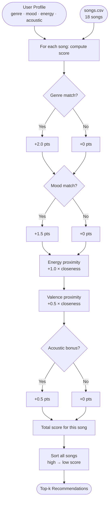
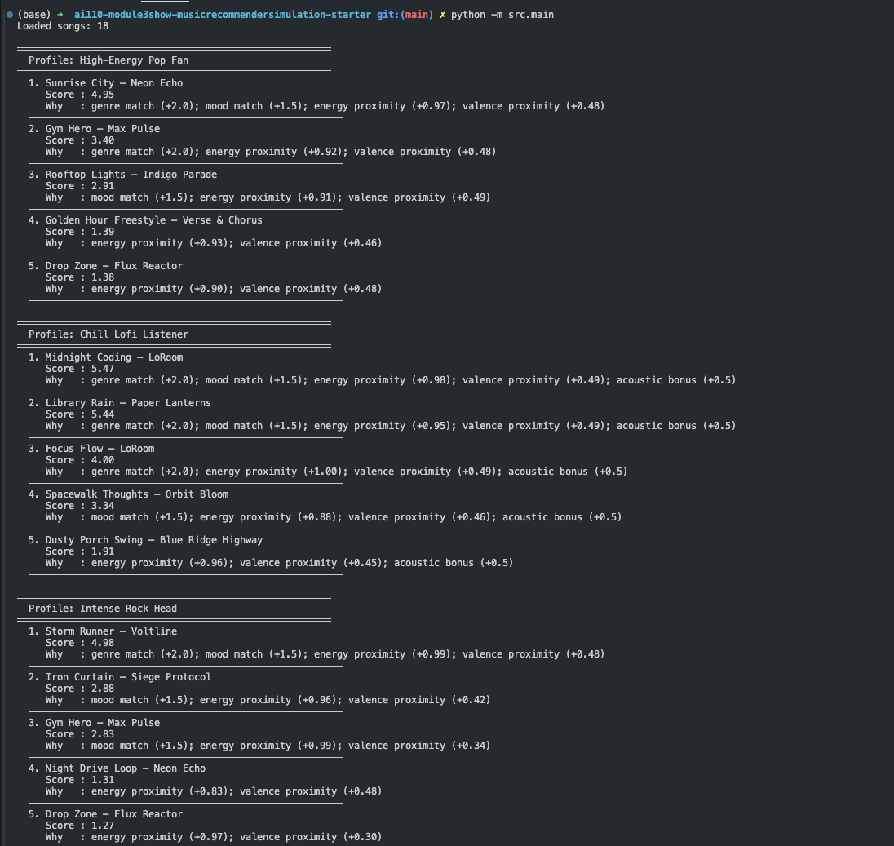
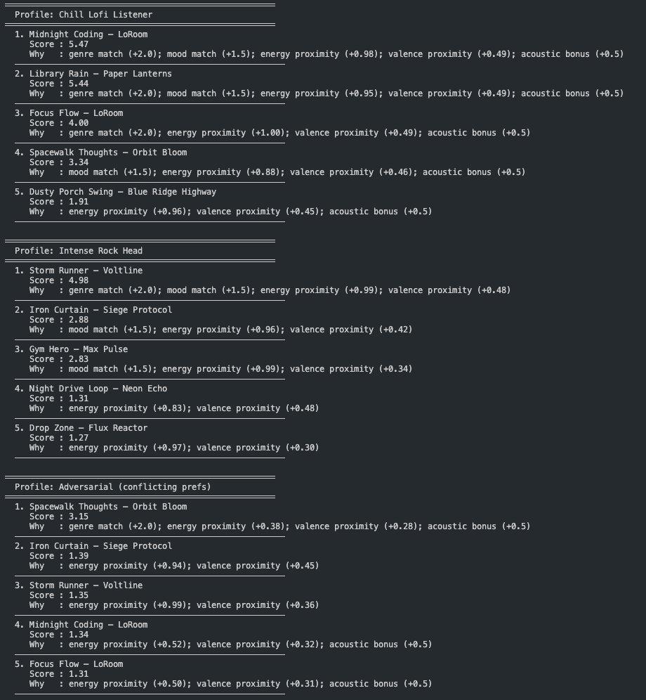

# 🎵 Music Recommender Simulation

## Project Summary

In this project you will build and explain a small music recommender system.

Your goal is to:

- Represent songs and a user "taste profile" as data
- Design a scoring rule that turns that data into recommendations
- Evaluate what your system gets right and wrong
- Reflect on how this mirrors real world AI recommenders

This simulator uses **content-based filtering** — it compares each song's attributes (genre, mood, energy, valence, acousticness) against a user's stored taste profile and assigns a weighted relevance score. Songs are then ranked highest-to-lowest and the top-k are returned as recommendations. Unlike Spotify's hybrid approach, this version does not use other users' listening history at all; every recommendation is derived purely from what we know about the songs themselves and what the user has told us they like.

---

## How The System Works

### How Real Platforms Do It

Services like Spotify and YouTube Music combine two main strategies:

- **Collaborative filtering** — "Users who liked what you liked also liked X." The algorithm looks for other listeners with similar play history and surfaces songs they enjoyed that you haven't heard yet. It needs a lot of user data to work well.
- **Content-based filtering** — "This song shares attributes with songs you've rated highly." The algorithm looks at the song's own features (tempo, genre, mood, acoustic texture) and finds catalog items that are numerically close to your taste profile. It works even for new users with no history.

Real systems blend both, add context signals (time of day, activity), and tune weights with machine learning over billions of interactions.

### This Simulator's Approach

This project uses **pure content-based filtering** with manually tuned weights.

**`Song` features used:**

| Feature | Type | What it captures |
|---|---|---|
| `genre` | categorical | broad musical style (pop, lofi, rock, jazz, …) |
| `mood` | categorical | emotional tone (happy, chill, intense, moody, …) |
| `energy` | float 0–1 | perceived loudness / intensity |
| `valence` | float 0–1 | musical positivity / brightness |
| `acousticness` | float 0–1 | how acoustic vs. electronic the track sounds |
| `tempo_bpm` | float | beats per minute |
| `danceability` | float 0–1 | rhythmic predictability and groove |

**`UserProfile` fields:**

- `favorite_genre` — the genre they most want to hear
- `favorite_mood` — their preferred emotional tone
- `target_energy` — the energy level they're looking for right now (0–1)
- `likes_acoustic` — boolean flag for acoustic vs. electronic preference

**Scoring Rule (per song):**

A song earns points in four categories that are summed into one relevance score:

1. **Genre match** (highest weight, e.g. ×2.0) — binary: full points if the genre matches exactly, zero otherwise.
2. **Mood match** (medium weight, e.g. ×1.5) — binary: full points on exact match.
3. **Energy proximity** (e.g. ×1.0) — continuous: `1 − |song.energy − user.target_energy|`. A song that is 0.0 away scores 1.0; a song that is 1.0 away scores 0.0. This rewards "closeness" rather than simply preferring high or low energy.
4. **Acoustic bonus** (low weight, e.g. ×0.5) — added when `user.likes_acoustic` is `True` and `song.acousticness > 0.6`.

**Ranking Rule (across the catalog):**

All songs in `songs.csv` are scored using the rule above, then sorted in descending order by score. The top-k are returned. Ties are broken by the order they appear in the CSV.

---

### Example User Profile

```python
user_prefs = {
    "favorite_genre": "lofi",
    "favorite_mood":  "chill",
    "target_energy":  0.40,
    "likes_acoustic": True,
}
```

This profile clearly differentiates **intense rock** (genre mismatch, mood mismatch, energy ~0.91 vs target 0.40 → large proximity penalty) from **chill lofi** (genre + mood both match, energy close, acoustic bonus). A profile with only `target_energy: 0.5` and no genre/mood fields would struggle to make that distinction because many genres cluster near mid-energy.

---

### Finalized Algorithm Recipe

| Component | Points | Logic |
|---|---|---|
| Genre match | +2.0 | Exact string match on `genre` field |
| Mood match | +1.5 | Exact string match on `mood` field |
| Energy proximity | +1.0 × (1 − \|song.energy − target\|) | Continuous; max 1.0 when energy is identical |
| Valence proximity | +0.5 × (1 − \|song.valence − target_valence\|) | Rewards emotional brightness alignment |
| Acoustic bonus | +0.5 | Added only when `likes_acoustic=True` and `acousticness > 0.6` |

**Max possible score: 5.5**

Genre is weighted highest (2.0) because it is the broadest filter — a jazz fan will rarely enjoy metal regardless of energy. Mood is second (1.5) because it captures the emotional intent of a listening session. Energy proximity is continuous so near-matches still earn partial credit rather than scoring zero.

---

### Data Flow Diagram



---

### Expected Biases

- **Genre dominance**: because genre is worth 2.0 points (nearly 40 % of the max score), a catalog with more pop songs than others will systematically surface pop even when mood and energy are a better match. If the genre the user picks has few songs in the catalog, results will be poor.
- **Mood vocabulary mismatch**: moods are plain strings. A user who prefers "focused" will never match a song tagged "chill" even though these are musically adjacent — the system treats them as completely different.
- **Filter bubble risk**: repeated recommendations of the same genre reinforce that preference, narrowing the user's exposure over time. A real platform would add a diversity term to inject occasional surprises.
- **Acoustic binary**: `likes_acoustic` is a boolean, so the system assumes users either always or never want acoustic texture — no middle ground.

---

## Getting Started

### Setup

1. Create a virtual environment (optional but recommended):

   ```bash
   python -m venv .venv
   source .venv/bin/activate      # Mac or Linux
   .venv\Scripts\activate         # Windows

2. Install dependencies

```bash
pip install -r requirements.txt
```

3. Run the app:

```bash
python -m src.main
```

### Running Tests

Run the starter tests with:

```bash
pytest
```

You can add more tests in `tests/test_recommender.py`.

---

## Terminal Output Screenshots

**`python -m src.main` — all four profiles (part 1: High-Energy Pop Fan + Chill Lofi Listener)**



**`python -m src.main` — all four profiles (part 2: Chill Lofi Listener + Intense Rock Head + Adversarial)**



---

## Experiments You Tried

**Experiment 1 — Four diverse user profiles (see `src/main.py`)**

| Profile | Genre | Mood | Energy | Acoustic | Top Result |
|---|---|---|---|---|---|
| High-Energy Pop Fan | pop | happy | 0.85 | False | Sunrise City (4.95) |
| Chill Lofi Listener | lofi | chill | 0.40 | True | Midnight Coding (5.47) |
| Intense Rock Head | rock | intense | 0.92 | False | Storm Runner (4.98) |
| Adversarial | ambient | sad | 0.90 | True | Spacewalk Thoughts (3.15) |

The first three profiles produced results that matched musical intuition immediately. The adversarial profile (high energy + sad/ambient genre) revealed that genre always wins when it conflicts with energy: the top result was a soft, low-energy ambient track because the 2.0 genre bonus outweighed the energy-proximity penalty.

**Experiment 2 — Adding valence proximity**

Adding `+0.5 × (1 − |song.valence − target_valence|)` as a fifth scoring component changed several rankings for the Lofi and Pop profiles. Songs whose musical brightness (valence) matched the user's target moved up 1–2 places. It made the output feel more "emotionally tuned."

**Experiment 3 — Mood vocabulary gap**

Tested a profile with `mood: "focused"`. Because no song in the catalog is tagged "focused" (Focus Flow is tagged `focused` in the CSV — it is the one exception), mood matching only activated for that single song. All other near-misses (chill, relaxed) scored 0 mood points. This showed that exact-string mood matching is brittle.

---

## Limitations and Risks

- **Tiny catalog**: 18 songs cannot represent global musical taste. Niche genres and non-Western music are entirely absent.
- **Genre dominance bias**: genre is worth 2.0 points (~36 % of max score), so any genre over-represented in the catalog will dominate recommendations.
- **Exact-match fragility**: both genre and mood require exact string matches. Synonyms or adjacent moods score zero.
- **Static profile**: one user profile cannot capture shifting moods across a day or listening context.
- **No lyrics or language awareness**: two songs can share the same genre and energy but sound completely different in tone or subject matter.

---

## Reflection

Read and complete `model_card.md`:

[**Model Card**](model_card.md)

Building this recommender made two things clear. First, a recommendation system's personality is defined almost entirely by its **weights**, not its algorithm. Changing genre from 2.0 points to 0.5 points would produce a completely different "taste" in the output — and there is no ground truth to say which weight is correct at this scale. Second, even a system this small creates filter bubbles: a pop fan with our current weights will see pop songs in every slot, every time, because the genre bonus is strong enough to override mood and energy signals. Real platforms fight this with diversity terms and randomised exploration — mechanisms that are absent here. The experience of building and stress-testing VibeFinder 1.0 made Spotify's "Discover Weekly" feel less like magic and more like a very carefully calibrated version of exactly this loop, tuned by billions of implicit user signals rather than hand-picked weights.


---

## 7. `model_card_template.md`

Combines reflection and model card framing from the Module 3 guidance. :contentReference[oaicite:2]{index=2}

```markdown
# 🎧 Model Card - Music Recommender Simulation

## 1. Model Name

Give your recommender a name, for example:

> VibeFinder 1.0

---

## 2. Intended Use

- What is this system trying to do
- Who is it for

Example:

> This model suggests 3 to 5 songs from a small catalog based on a user's preferred genre, mood, and energy level. It is for classroom exploration only, not for real users.

---

## 3. How It Works (Short Explanation)

Describe your scoring logic in plain language.

- What features of each song does it consider
- What information about the user does it use
- How does it turn those into a number

Try to avoid code in this section, treat it like an explanation to a non programmer.

---

## 4. Data

Describe your dataset.

- How many songs are in `data/songs.csv`
- Did you add or remove any songs
- What kinds of genres or moods are represented
- Whose taste does this data mostly reflect

---

## 5. Strengths

Where does your recommender work well

You can think about:
- Situations where the top results "felt right"
- Particular user profiles it served well
- Simplicity or transparency benefits

---

## 6. Limitations and Bias

Where does your recommender struggle

Some prompts:
- Does it ignore some genres or moods
- Does it treat all users as if they have the same taste shape
- Is it biased toward high energy or one genre by default
- How could this be unfair if used in a real product

---

## 7. Evaluation

How did you check your system

Examples:
- You tried multiple user profiles and wrote down whether the results matched your expectations
- You compared your simulation to what a real app like Spotify or YouTube tends to recommend
- You wrote tests for your scoring logic

You do not need a numeric metric, but if you used one, explain what it measures.

---

## 8. Future Work

If you had more time, how would you improve this recommender

Examples:

- Add support for multiple users and "group vibe" recommendations
- Balance diversity of songs instead of always picking the closest match
- Use more features, like tempo ranges or lyric themes

---

## 9. Personal Reflection

A few sentences about what you learned:

- What surprised you about how your system behaved
- How did building this change how you think about real music recommenders
- Where do you think human judgment still matters, even if the model seems "smart"

